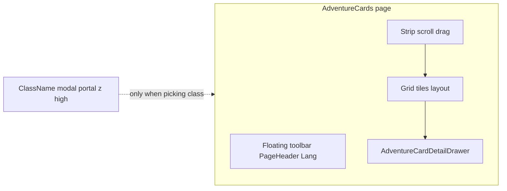

# AdventureCards: drawer + lưới giống Characters, một lớp popup

## Hiện trạng

- `[AdventureCards.tsx](admin-web/src/pages/AdventureCards.tsx)`: header + filter + lưới cố định; mở `[AdventureCardEditModal](admin-web/src/components/adventureCards/AdventureCardEditModal.tsx)` (portal toàn màn hình).
- `[AdventureCardEditModal](admin-web/src/components/adventureCards/AdventureCardEditModal.tsx)`: trong **một** overlay đã có thêm **hai “popup” phụ** cùng flex row — `[I18nEditorPanel](admin-web/src/components/i18n/I18nEditorPanel.tsx)` khi sửa Name/Description i18n và `[ClassNamePickerPanel](admin-web/src/components/adventureCards/ClassNamePickerPanel.tsx)` khi chọn class — nên cảm giác nhiều lớp UI chồng nhau.
- `[Characters.tsx](admin-web/src/pages/Characters.tsx)`: `detailOpen` → khóa scroll `#admin-main-scroll`, toolbar cố định, `colScrollRef` + `stripPointerDown` / `suppressItemClickRef`, `LayoutGroup` + `motion.div` `layout` thu cột lưới (~20%) khi mở `[CharacterDetailDrawer](admin-web/src/components/characters/CharacterDetailDrawer.tsx)` (drawer **không** phải modal giữa màn hình).

## Hướng thiết kế

1. **Trang `[AdventureCards.tsx](admin-web/src/pages/AdventureCards.tsx)`**
  Áp dụng cùng “khung” với Characters (đã có sẵn token trong `[motionPresets](admin-web/src/components/animations/motionPresets.ts)` như `charactersDrawerShellDurationClass`, `fadeSlideCard`, `slideUpItem`, v.v.):
  - `detailOpen = edit.editOpen && edit.editCard` (giữ hook hiện tại, không bắt buộc đổi sang `selectedId` trừ khi muốn derive từ list).
  - Khi `detailOpen`: `min-h-0 flex-1`, `overflow-hidden` cho shell; wrapper cột trái `ref={colScrollRef}` với class giống Characters (kéo dọc, ẩn scrollbar, `cursor-grab`, `onDragStart` chặn drag mặc định).
  - Copy logic `**stripPointerDown**` / `**suppressItemClickRef**` và `**onClick` trên vùng strip** (click nền đóng drawer nếu cần — đối chiếu hành vi Characters).
  - `useEffect` khóa `document.getElementById('admin-main-scroll')` khi drawer mở (giống `[Characters.tsx` L88–96](admin-web/src/pages/Characters.tsx)).
  - Lưới: khi `detailOpen` dùng `grid-cols-1 gap-2` + thu hẹp card; khi đóng `grid-cols-1 sm:grid-cols-2 lg:grid-cols-4 gap-4`; bọc item trong `motion.div` với `layout` + `LayoutGroup id="adventure-cards-grid"` như Characters.
  - Toolbar (nút Thêm mới + `LangDropdown`): đặt `fixed`/`pointer-events` giống Characters để không bị đẩy bởi layout drawer.
  - Thay `{edit.editOpen && edit.editCard && <AdventureCardEditModal ... />}` bằng drawer nằm **trong flex** (cột phải), không portal full-screen cho toàn bộ form.
2. **Drawer mới (thay thế body của modal edit)**
  - Tạo component kiểu `**AdventureCardDetailDrawer`** (có thể đặt tại `admin-web/src/components/adventureCards/`), bám shell `[CharacterDetailDrawer](admin-web/src/components/characters/CharacterDetailDrawer.tsx)`: `role="dialog"`, `aria-roledescription="drawer"`, thanh kéo đóng (drag X), header tiêu đề, vùng scroll `flex-1 overflow-y-auto`.
  - Nội dung: tái sử dụng `[AdventureCardImagePicker](admin-web/src/components/adventureCards/AdventureCardImagePicker.tsx)` + `[AdventureCardEditForm](admin-web/src/components/adventureCards/AdventureCardEditForm.tsx)` + khối treasure `[CardDeckBuilder](admin-web/src/components/maps/CardDeckBuilder.tsx)` như trong modal hiện tại; nút **Hủy / Lưu** ở footer drawer (gọi `requestCloseEdit`, `handleSaveCard`).
  - `[UnsavedChangesDialog](admin-web/src/components/unsavedChanges)`: render cùng cấp drawer (portal hoặc trong drawer wrapper) với z-index cao hơn drawer — vẫn một lần hỏi khi đóng có dirty form.
3. **Name / Description i18n — không còn `I18nEditorPanel` riêng**
  - Trong `[AdventureCardEditForm](admin-web/src/components/adventureCards/AdventureCardEditForm.tsx)` (hoặc khối con): hiển thị **trực tiếp** hai section (bố cục rõ ràng, giống tinh thần form trong Characters — nhãn uppercase nhỏ, khoảng cách đều):
    - **Tên (i18n)**: 3 ô EN / VI / JA + nút dịch (theo `editLang` làm base) + lưu bản dịch tên.
    - **Mô tả (i18n)**: 3 textarea tương tự + dịch + lưu.
  - Cập nhật `[useAdventureCardEdit](admin-web/src/components/adventureCards/useAdventureCardEdit.ts)`:
    - Giữ API `localizationService` như `handleI18nSave` / `handleI18nTranslate` nhưng **tách state** cho name và description (ví dụ `nameI18nEn/Vi/Ja` và `descI18nEn/Vi/Ja`), load cả hai khi `handleOpenEdit` (hoặc `useEffect` khi `editCard` đổi) — bỏ `i18nField` + `openI18nEditor` kiểu mở panel.
    - Hai hàm save/translate tương ứng `name` | `description` (có thể refactor từ code hiện có của `handleI18nSave`).
4. **Chọn Class name — “một modal”**
  - Không render `ClassNamePickerPanel` cạnh form trong cùng “modal edit” nữa.
  - Khi bấm chọn class: mở **một** `createPortal` toàn màn (overlay + panel), pattern giống `[Characters.tsx` create + classPickerOpen](admin-web/src/pages/Characters.tsx) (hoặc chỉ một cột giữa chứa `[ClassNamePickerPanel](admin-web/src/components/adventureCards/ClassNamePickerPanel.tsx)`), `z-index` cao hơn drawer (ví dụ `z-[9999]`). Đóng picker chỉ tắt layer này; drawer vẫn mở.
  - Có thể tách nhỏ `**AdventureCardClassNameModal`** để trang gọi khi `edit.classNamePickerOpen` — logic `selectClassName` / `closeClassNamePicker` giữ trong hook.
5. **Create**
  - `[AdventureCardCreateModal](admin-web/src/components/adventureCards/AdventureCardCreateModal.tsx)` có thể **giữ nguyên** một modal tạo mới (đã không chồng I18n panel). Nếu sau này cần chọn class khi tạo, áp dụng cùng portal class-name một lớn như trên.
6. **Dọn dẹp**
  - Gỡ `[AdventureCardEditModal](admin-web/src/components/adventureCards/AdventureCardEditModal.tsx)` hoặc thu gọn thành re-export nếu còn chỗ import — ưu tiên xóa/inline để tránh nhầm.

## Rủi ro / kiểm tra

- **Ảnh trong tile**: vẫn mở cây trong `[AdventureCardImagePicker](admin-web/src/components/adventureCards/AdventureCardImagePicker.tsx)` (inline trong card preview) — không thêm modal mới; đây là UX hiện có và không phải “popup” thứ hai toàn trang.
- **Focus / Esc**: drawer nên bắt `Escape` đóng (như CharacterDetailDrawer) và không để hai dialog cạnh tranh focus khi modal class mở (ưu tiên đóng modal class trước).

