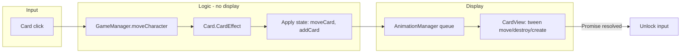

# Kế hoạch: Tách logic game và CardView, bỏ callback trong animation

## Mục tiêu

- **Card**: chỉ chứa dữ liệu và logic game (CardEffect, takeDamage, die, …), không kế thừa Phaser, không gọi tween/display.
- **CardView**: lớp hiển thị (extends Phaser.GameObjects.Container), toàn bộ code vẽ thẻ + HUD + xử lý input + thao tác animation (destroy/creation).
- **AnimationManager**: giữ hàng đợi hiện tại, chỉ đổi từ callback sang Promise (ít sửa).
- **Luồng**: logic xong hết → apply state (grid) → đẩy animation vào queue (Promise) → khi chạy xong mới unlock input / emit completeMove.

---

## Kiến trúc sau refactor

- **Card** (model): `index`, `name`, `nameId`, `type`, `config`, và state theo loại (hp, score, weapon, …). Có `view: CardView`. Method: `CardEffect()`, `takeDamage()`, `die()`, … không gọi `scene.tweens` hay `scene.add`.
- **CardView** (view): extends `Phaser.GameObjects.Container`, tạo từ Card (đọc type/nameId/config để vẽ). Method: `playDestroy()`, `playCreation()`, `updateDisplay(...)`, setInteractive + pointer. Chỉ nhận “lệnh hiển thị”, không chạy logic game.

---

## Các bước thực hiện

### Bước 1: Định nghĩa CardView và giao diện hiển thị

- **Tạo file mới** [TeyvatCard/src/components/card/CardView.ts](TeyvatCard/src/components/card/CardView.ts) (hoặc `TeyvatCard/src/view/CardView.ts` tùy cấu trúc hiện tại).
- **CardView** extends `Phaser.GameObjects.Container`:
  - Constructor nhận `scene`, `x`, `y`, và **dữ liệu hiển thị** (hoặc tham chiếu tới Card model chỉ để đọc: type, nameId, config, hp, score, …).
  - Chuyển toàn bộ phần **hiển thị** từ [Card.ts](TeyvatCard/src/modules/Card.ts) sang:
    - Tạo border, cardImage (atlas), HUD (createDisplay / addDisplayHUD) dựa trên type/nameId/config.
    - `setInteractive`, `pointerdown`/`pointerup`/`pointerover`/`pointerout` → gọi delegate (callback) khi click / long-press, không gọi `gameManager.moveCharacter` trực tiếp (delegate do GameManager hoặc Card binding).
  - Method animation:
    - `playDestroy()`: tween alpha/scale rồi `destroy()` (giữ logic hiện tại của `ProgressDestroy`, không nhận callback).
    - `playCreation()`: set alpha/scale rồi tween (giữ logic `processCreation`).
  - Method cập nhật HUD: `updateText(displayKey, value)`, `updateTexture(...)` (để logic bên ngoài gọi sau khi state đổi).
- **Tách types** dùng chung: `CreateDisplayOptions`, `DisplayPosition`, `CreateDisplayResult` có thể nằm trong Card.ts hoặc file types riêng; CardView chỉ phụ thuộc vào interface “display data” từ Card.

### Bước 2: Refactor Card thành lớp chỉ logic (model)

- **Sửa** [TeyvatCard/src/modules/Card.ts](TeyvatCard/src/modules/Card.ts):
  - Card **không** còn `extends Phaser.GameObjects.Container`.
  - Card là class thuần: thuộc tính `index`, `name`, `nameId`, `type`, `config`, `unsubscribeList`, v.v.
  - Thêm `view: CardView | null`. View được tạo khi card được “gắn” lên scene (xem bước 3).
  - Giữ/refactor: `applyConfig`, `GetRandom`, `CardEffect()`, `takeDamage()`, `die()`.
  - **die()**: chỉ cập nhật logic (ví dụ yêu cầu thay thẻ tại index), **không** gọi `ProgressDestroy` hay `processCreation`; phần đó do GameManager/AnimationManager đưa vào queue và gọi trên `CardView`.
  - Xóa: `createCard`, `addDisplayHUD`, `addCardNameIfEnabled`, `createDisplay`, `ProgressDestroy`, `processCreation`, `setInteractive`, pointer handlers, `showCardInfoDialog`, `getDescription`. Phần tạo/bind view và input chuyển sang CardView và nơi khởi tạo (CardFactory / GameManager).
- **Card** cần cách “tạo view tương ứng”: có thể `Card.createView(scene)` trả về `CardView` (dựa trên `this.type` và subclass) hoặc factory nhận Card + scene trả về CardView.

### Bước 3: CardManager và CardFactory làm việc với Card + CardView

- **CardManager** [TeyvatCard/src/core/CardManager.ts](TeyvatCard/src/core/CardManager.ts):
  - `cards: (Card | null)[]` — lưu **Card** (model).
  - `addCard(card: Card, gridIndex: number)`: nếu `card.view` chưa có thì tạo (vd `card.ensureView(scene)` hoặc factory), `scene.add.existing(card.view)`, set vị trí từ `getGridPositionCoordinates(gridIndex)`; gán `this.cards[gridIndex] = card`.
  - `getCard(index)`: trả về `Card | null`. Mọi chỗ cần “display” (tween, destroy, setPosition) dùng `card.view`.
  - `moveCard(fromIndex, toIndex)`: đổi chỗ trong `cards[]`, cập nhật `card.index`, **và** cập nhật vị trí view (setPosition hoặc để animation queue làm tween).
  - `getAllCards()`: trả về `Card[]`.
  - Chỗ gọi `card.resonance()` giữ nguyên (gọi trên Card); resonance có thể đổi state, sau đó view cập nhật qua `card.view.updateDisplay(...)` hoặc lệnh trong animation plan.
- **CardFactory** [TeyvatCard/src/modules/CardFactory.ts](TeyvatCard/src/modules/CardFactory.ts):
  - `createRandomCard`, `createCoin`, `createCardByKey`, `createCharacter`, … trả về **Card** (model), không còn `scene.add.existing(this)`. View sẽ do CardManager (hoặc Card) tạo khi `addCard`.
  - Mỗi subclass (Eula, PyroFragment, …) constructor chỉ gọi `super(scene, x, y, index, ...)`, `applyConfig(config)` và **không** gọi `createCard()` hay `scene.add.existing(this)`.

### Bước 4: AnimationManager bỏ callback, dùng Promise

- **Sửa** [TeyvatCard/src/core/AnimationManager.ts](TeyvatCard/src/core/AnimationManager.ts):
  - Đổi `AnimationQueueItem` từ `function: (completeCallback: () => void) => void` sang `function: () => Promise<void>`.
  - `addToQueue(priority, fn: () => Promise<void>)`: push vào queue; nếu đang không chạy thì `processQueue()`.
  - `executeAnimation(fn)`: gọi `fn().then(() => this.completeAnimation()).catch(...)` thay vì `fn(completeCallback)`.
  - **startMoveAnimation**: thay vì `onComplete?: () => void`, trả về `Promise<void>` hoặc nhận optional `Promise` resolution. Bên trong dùng `new Promise<void>(resolve => { ... onComplete: () => resolve() })` rồi đưa vào `addToQueue(priority, () => thatPromise)`.
  - Tương tự **startGameOverAnimation**, **startSwapCardsAnimation**, **startShuffleAllCardsAnimation**, **startBreatheFireAnimation**, **startExplosiveAnimation**, **startItemAnimation**: mỗi method trả về `Promise<void>` và bên trong wrap tween/timer bằng Promise, rồi `addToQueue(priority, () => thatPromise)`.
  - Caller (GameManager) sẽ dùng `await animationManager.startMoveAnimation(...)` hoặc `.then(() => { ... })` thay vì truyền callback.

### Bước 5: GameManager — logic trước, state apply, rồi animation (không callback)

- **Sửa** [TeyvatCard/src/core/GameManager.ts](TeyvatCard/src/core/GameManager.ts) `moveCharacter(index)`:
  1. **Lock**: giữ check `animationManager.isProcessing` (hoặc flag `inputLocked`) để không nhận input mới.
  2. **Logic**: `isValidMove`, `getCard(index)`, `(card as Card).CardEffect()`. Nếu effect “consume move” thì emit `completeMove` và return (unlock).
  3. **Apply state trước** (không đợi animation):
    - Lưu tham chiếu `cardToDestroy = getCard(index)` (Card model).
    - `movement = calculateMovement(...)`.
    - `dataManager.setFlag('cardAtOldCharacterPos', ...)`.
    - Gọi `movement.forEach(move => this.cardManager.moveCard(move.from, move.to))`.
    - Tạo `newCard = cardFactory.createRandomCard(...)`, `cardManager.addCard(newCard, newCardIndex)` (addCard sẽ tạo view và add lên scene).
  4. **Animation** (sau khi state đã đúng):
    - Enqueue destroy view của `cardToDestroy`: gọi `cardToDestroy.view.playDestroy()` trong một task trả về Promise (tween xong resolve).
    - Enqueue move: `animationManager.startMoveAnimation(movement)` — bên trong dùng **view** từ `cardManager.getCard(i).view` để tween vị trí; method trả về Promise.
    - Enqueue creation: `newCard.view.playCreation()` trong task Promise.
    - Hoặc gom một “batch” vào một Promise duy nhất (chạy tuần tự destroy → move → creation) rồi `addToQueue(priority, () => batchPromise)`.
  5. **Sau khi animation xong**: Promise resolved → emit `completeMove`, set `isProcessing = false` (unlock).
- **gameOver()**: apply state (high score, totalCoin, …) trước; `startGameOverAnimation` nhận danh sách Card, lấy `.view` để destroy từng cái, trả về Promise; khi Promise resolve mới gọi `showGameOverDialog()`.

### Bước 6: Subclass Card (typeCard + models/cards)

- **typeCard** (coin, character, enemy, equipment, …): đổi thành extend **Card** (model). Xóa mọi gọi `createCard()`, `scene.add.existing`, `ProgressDestroy`, `processCreation`. Logic như `takeDamage`, `die`, `CardEffect`, `resonance` chỉ đổi state; khi cần cập nhật HUD thì gọi `this.view?.updateText(...)` nếu muốn sync ngay, hoặc để animation/command cập nhật view sau.
- **Character**: `takeDamage`, `heal`, `reduceDurability`, `setWeapon` chỉ cập nhật số liệu; gọi `this.view?.updateText('hp', this.hp)` v.v. (CardView cần API update tương ứng).
- **Enemy**, **Coin**: tương tự — logic trong Card, view chỉ nhận lệnh vẽ/cập nhật và playDestroy/playCreation.
- **models/cards/** (Eula, PyroFragment, …): constructor chỉ gọi `super`, `applyConfig`, không gọi `createCard()` hay `scene.add.existing(this)`.

### Bước 7: CardView đủ loại thẻ (HUD, popup, badge)

- CardView có thể nhận “display descriptor” từ Card (type, nameId, config, hp, score, weaponDurability, …) và vẽ HUD chung (createDisplay cho số). Subclass CardView theo từng type (CharacterView, EnemyView, CoinView) nếu cần khác biệt lớn; hoặc một CardView với branch theo type.
- Popup damage/heal: có thể là method trên CardView `showPopup(amount, type)` do GameManager/Card gọi sau khi logic takeDamage/heal chạy (hoặc đưa vào “animation plan” và queue gọi view.showPopup). Giữ SpritesheetWrapper cho slash/bomb nếu cần, gọi từ phía đẩy vào queue hoặc từ view khi nhận lệnh.

### Bước 8: Input và completeMove

- CardView khi click gọi delegate (vd `onCardClick(index)` do GameManager đăng ký). GameManager vẫn `moveCharacter(index)`.
- `completeMove` vẫn emit sau khi **animation** xong (trong Promise then), để poison/recovery/resonance chạy đúng sau lượt đi + animation.

---

## Thứ tự file cần sửa (tóm tắt)

| Thứ tự | File                                         | Nội dung chính                                                                                          |
| ------ | -------------------------------------------- | ------------------------------------------------------------------------------------------------------- |
| 1      | `CardView.ts` (mới)                          | Container, createCard visual, setInteractive, playDestroy, playCreation, updateDisplay                  |
| 2      | `Card.ts`                                    | Bỏ extend Container, chỉ logic, thêm view, bỏ createCard/ProgressDestroy/processCreation/input          |
| 3      | `AnimationManager.ts`                        | addToQueue(fn: () => Promise), start* trả về Promise, bỏ onComplete callback                            |
| 4      | `GameManager.ts`                             | moveCharacter: apply state trước, rồi enqueue animation bằng Promise, then emit completeMove            |
| 5      | `CardManager.ts`                             | cards: Card[], addCard tạo view và add scene, getCard trả Card, moveCard cập nhật model + view position |
| 6      | `CardFactory.ts`                             | Trả về Card, không gọi createCard/add.existing                                                          |
| 7      | typeCard (character, coin, enemy, equipment) | Chỉ logic, gọi view?.update* khi đổi state                                                              |
| 8      | models/cards/* (Eula, PyroFragment, …)       | Bỏ createCard(), scene.add.existing(this)                                                               |

---

## Rủi ro và lưu ý

- **CardManager.getCharacterIndex()**: hiện dựa vào `cards[i].type === 'character'` và `CardCharacter` — giữ nguyên vì Card vẫn có `.type`.
- **checkElementResonance**: gọi `card.resonance()` trên Card; resonance đổi state (nameId, score, …), cần đồng bộ sang view (update texture/text) qua `card.view.updateDisplay(...)` hoặc lệnh trong queue.
- **Item buttons / gameOver**: cùng nguyên tắc — logic + state trước, animation vào queue, Promise xong mới bước tiếp theo.
- Có thể làm từng bước nhỏ: trước hết thêm CardView và chuyển display sang view (Card vẫn extend Container tạm), sau đó mới tách hẳn Card thành model và bỏ callback animation.

