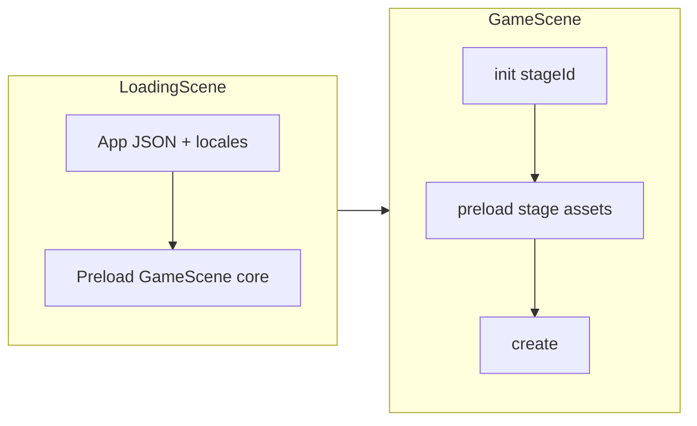

# Kế hoạch lazy load asset cho GameScene

## Hiện trạng (đã đọc code)

- [`LoadingScene.ts`](TeyvatCard/src/scenes/LoadingScene.ts): Sau khi có theme + JSON app (`libraryCards.json`, `dungeonList.json`, …), gọi `assetManager.preloadSceneAssets(this.targetScene, …)` rồi `scene.start(targetScene, dataTargetScene)`.
- [`AssetManager.ts`](TeyvatCard/src/core/AssetManager.ts): `GameScene` đang preload **danh sách atlas cố định** (`ATLAS_PATHS_BY_SCENE.GameScene`: item, character, coin, weapon-catalyst/sword, enemy-hilichurl, food, trap, treasure, bomb, badge…) + **ảnh/audio cố định** (nền mọi map trong `dungeonList`, toàn bộ `WEAPON_CATALYST_*`, `ANIMATIONS_ASSETS`, `CHARACTER_SPRITE_ASSETS`, …).
- [`GameScene.ts`](TeyvatCard/src/scenes/GameScene.ts): Không có `preload()`; chỉ dùng texture đã load sẵn trong `init`/`create`.
- [`dungeonList.json`](TeyvatCard/public/data/dungeonList.json): Mỗi map có `availableCards` (theo nhóm `enemies`, `weapons`, …) — **đúng tập thẻ có thể xuất hiện** trên map đó.
- [`libraryCards.json`](TeyvatCard/public/data/libraryCards.json) (và bản server): Metadata `type`, `category`, `clan`, `className`, `id` — hiện client suy **atlas key** từ `type`/`category`/`clan` qua [`buildCardAtlasKey` / `getLibraryCardAtlasKey`](TeyvatCard/src/modules/card/view.ts) + [`libraryCardAtlas.ts`](TeyvatCard/src/components/LibraryScene/libraryCardAtlas.ts). **Hướng mới (đề xuất)**: bổ sung field do **server export** (xem mục dưới) để không phải nhân đôi quy tắc ở nhiều nơi.

## Mục tiêu

1. **Giảm bytes / số request** trước khi vào trận bằng cách không tải atlas/ảnh không dùng trên map (ví dụ map chỉ sword thì không cần atlas `weapon-catalyst` + ảnh catalyst rời).
2. **Giữ ưu tiên atlas** (một file ảnh + JSON) thay vì nhiều ảnh lẻ khi số thẻ cùng nhóm đủ lớn — phù hợp cách render hiện tại (`createCardImage` ưu tiên atlas + frame).
3. **Có đường thoát hiểu nghĩa**: nếu sau này có thẻ chỉ có file lẻ (không nằm atlas), có thể bổ sung metadata hoặc manifest để `loadImage` có chọn lọc.

## Đề xuất kiến trúc

### 0) Lưu `atlasKey` trong JSON do server sinh — có hợp lý không?

**Có.** Lý do:

- **Một nguồn sự thật cho nội dung**: designer/admin chỉnh trong luồng server (hoặc export từ tool) thay vì sửa logic client mỗi khi đổi cách gói atlas.
- **Ít lỗi “suy sai”**: quy tắc `weapon` + `category` → `weapon-{category}` hiện trùng với file `atlas/weapon-sword.json`, nhưng trường hợp đặc biệt (thẻ nằm atlas khác tên, hotfix frame) được mô tả rõ bằng dữ liệu.
- **Lazy load đơn giản**: union các `atlasKey` từ các `className` trong `availableCards` (sau khi tra entry) → danh sách file `atlas/<atlasKey>.json` cần tải, không cần nhánh `if type === …` dài trong `AssetManager`.

**Gợi ý field (mỗi entry trong `libraryCards` theo loại thẻ):**

- `atlasKey` (string, bắt buộc khi đã rollout): ví dụ `enemy-hilichurl`, `weapon-sword` — trùng **texture key** sau khi Phaser load atlas (như `meta.image` bỏ `.webp`).
- `frameId` (string, tuỳ chọn): nếu khác `id` hiện dùng làm frame; nếu bỏ thì client giữ quy ước `frameId = id` như [`getLibraryCardAtlasKey`](TeyvatCard/src/components/LibraryScene/libraryCardAtlas.ts).
- (Tuỳ chọn sau) `textureMode: 'atlas' | 'image'` + `imagePath` khi muốn ép ảnh lẻ — không bắt buộc v1.

**Client**: `getLibraryCardAtlasKey` / preload resolver đọc `atlasKey` trước; nếu entry cũ chưa có field, **fallback** `buildCardAtlasKey(entry)` để không gãy game trong giai đoạn migration.

**Server**: chỉnh pipeline tạo `libraryCards.json` (và bất kỳ bản API tương đương) để emit các field này; đồng bộ file tĩnh [`TeyvatCard/public/data/libraryCards.json`](TeyvatCard/public/data/libraryCards.json) khi deploy.

### 0b) [`filesService.ts`](server/src/services/filesService.ts): đã có thể “tổng hợp ảnh → JSON atlas” chưa? “Chỉ JSON name/id” thì sao?

**Đã có pipeline mạnh — nhưng input hiện tại là đường dẫn ảnh, không phải chỉ id trừu tượng.**

Các hàm liên quan (đọc code):

- [`generateCustomAtlas(webPaths, baseName)`](server/src/services/filesService.ts): nhận danh sách **web path** ảnh (`/assets/images/...` hoặc `/uploads/...`), resolve file trên đĩa qua `getImagesRootPath()` / upload resolver, ghép sheet bằng [`buildAtlasBuffers`](server/src/services/filesService.ts) (Sharp: grid gần vuông), sinh JSON Phaser-compatible qua [`buildAtlasMetadata`](server/src/services/filesService.ts) (`frames[name].frame.{x,y,w,h}`, `meta.image`, `meta.size`, `meta.path` — cùng kiểu client [`AssetManager.loadAtlas`](TeyvatCard/src/core/AssetManager.ts)).
- **Frame key hiện tại**: lấy từ **tên file** (basename bỏ đuôi), *không* phải từ một field `id` tùy ý trong JSON nếu tên file khác `id` trong game ([`frameKey` từ `path.basename`](server/src/services/filesService.ts) trong vòng resolve `webPaths`).
- **Ghi file & “cache” tái sử dụng**:
  - Xuất `.webp` + `.json` vào [`getTeyvatCardsPublicPath()`](server/src/services/filesService.ts) và nhân bản vào [`getAtlasTempDir()`](server/src/services/filesService.ts) (`server/atlas`) để Manager Assets phục vụ URL `/atlas/...`.
  - Biến thể **desktop/mobile**: resize từng ảnh nguồn vào cây con dưới `atlas/desktop/`, `atlas/mobile` theo [`toAtlasCacheRelativePath`](server/src/services/filesService.ts) + [`ensureAtlasVariantCachedImage`](server/src/services/filesService.ts) — **cache theo đường dẫn ảnh gốc** (nếu đã có file resized thì không xử lý lại).
- [`generateAllCardsAtlas`](server/src/services/filesService.ts): quét cây thư mục card, key frame = key suy từ cây (flatten), không cần list tay.

**“Chỉ JSON name/id” (không gửi kèm full web path mỗi ảnh)** — **hợp lý làm bước kế**, nhưng cần **bước resolve**:

1. Từ `id` hoặc `className` (ví dụ `sword-steampunk`, `AnemoSamachurl`) → `webPath` file thật: dùng chung một quy ước (tra [`libraryCards`](TeyvatCard/public/data/libraryCards.json) thêm field `cardImageWebPath` / `sourceAssetPath`) hoặc map cố định giống [`AssetConstants`](TeyvatCard/src/utils/AssetConstants.ts).
2. Sau khi có danh sách `webPath`, gọi lại logic hiện có hoặc refactor nhận `{ webPath, frameId }[]` để **`frameId` trong JSON = `id` thẻ** (không bắt buộc trùng tên file) — *đây là chỉnh nhỏ so với code hiện tại* (hiện frameKey = basename).
3. **Cache “không build lại atlas” khi không đổi nguồn**: hiện **chưa** có manifest hash (danh sách id + mtime/size) để skip `generateCustomAtlas`; kế hoạch có thể thêm file manifest cạnh atlas (ví dụ `my-map-pack.manifest.json`: input fingerprint → chỉ rebuild khi đổi).

**Kết luận cho phiên kế hoạch (không build):** Server **đã có thể** xuất atlas JSON + webp và cache resize desktop/mobile; để workflow “admin chỉ chọn / JSON chỉ có id”, cần **lớp mapping id → path + (tuỳ chọn) ép frame name = id** và **(tuỳ chọn) manifest để tái sử dụng build**.

### 1) Tách “core” vs “theo stage”

- **Core (luôn load trong `preloadSceneAssets('GameScene')` hoặc giai đoạn 1)** — tối thiểu để UI/character/deck không vỡ:
  - Atlas: `item`, `character`, `coin` (và `empty` / ảnh empty nếu không nằm atlas).
  - Audio: `SOUND_EFFECT_ASSETS` (hoặc tách nhỏ sau nếu cần).
  - **Nền map**: chỉ texture của **map đang chơi** (đã gần đúng ý tưởng “theo stage”; hiện tại [`queueGameSceneMapBackgroundTexture`](TeyvatCard/src/core/AssetManager.ts) load mọi `map_background` trong list — nên thu hẹp theo `stageId` truyền từ LoadingScene).
- **Theo stage (lazy trong `GameScene.preload()` hoặc batch 2 trước `create`)**:
  - Từ `dungeonList` tìm bản ghi `stageId === …`.
  - Lấy **tất cả** `className` trong `availableCards` (gộp các nhóm).
  - Với mỗi `className`, tra trong `libraryCards` (theo `className`) → lấy **`entry.atlasKey` nếu có**, không thì fallback `buildCardAtlasKey(entry)` ([`view.ts`](TeyvatCard/src/modules/card/view.ts)).
  - Map `atlasKey` → đường dẫn JSON quy ước: `atlas/${atlasKey}.json` (đồng bộ với cách đặt tên file hiện tại).
  - **Hợp badge**: nếu map có `weapon` loại `sword`, thêm `atlas/weapon-sword-badge.json` khi UI bán/badge cần (điều kiện cụ thể nên khớp chỗ dùng texture badge trong game — hiện GameScene đang load sẵn catalyst badge images; cần **lọc theo category thật sự có trên map + vũ khí nhân vật** để không thiếu texture khi đổi đồ).

### 2) Truyền `stageId` vào pipeline preload

- [`LoadingScene`](TeyvatCard/src/scenes/LoadingScene.ts) đã có `this.dataTargetScene` (ví dụ `{ stageId }` từ [`MapScenes`](TeyvatCard/src/scenes/MapScenes.ts)).
- **Thay đổi cần có**: `assetManager.preloadSceneAssets('GameScene', cb, context)` nhận thêm `{ stageId?: string }` để:
  - Lọc background chỉ một map.
  - (Tuỳ chọn) Nếu muốn giữ **một lần load hết** trong LoadingScene: truyền `stageId` vào và tính danh sách atlas theo stage ngay ở đó — không bắt buộc tách sang `GameScene.preload()` nếu bạn muốn tránh màn hình đen thêm một phase; khi đó “lazy” = **ít asset hơn**, không nhất thiết = **scene thứ hai**.

### 3) GameScene: thêm `preload()` (nếu chọn lazy sau LoadingScene)

- Phaser chạy `init → preload → create`; `stageId` set trong `init` từ `SceneData` sẵn có cho `preload`.
- Trong `preload()`: queue batch atlas JSON qua `DataManager.queueJsonFromData` + `load.start()` giống pattern trong [`AssetManager.preloadSceneAssets`](TeyvatCard/src/core/AssetManager.ts) (có thể **tách hàm dùng chung** `loadAtlasBatchFromPaths(scene, paths, onComplete)` để tránh duplicate logic `onAtlasJsonBatchComplete`).
- **Lưu ý**: `CardFactory` / `setCurrentStage` hiện chạy trong [`CardManager` constructor](TeyvatCard/src/core/CardManager.ts) khi `create()` — thứ tự vẫn ổn vì atlas chỉ cần sẵn trước khi tạo thẻ/lưới; nếu có code nào tạo sprite trong `preload`, phải đảm bảo texture đã load.

### 4) Ảnh rời (`AssetConstants`) — lọc thay vì xoá hết

- [`queueNonAtlasAssets` GameScene](TeyvatCard/src/core/AssetManager.ts) đang `loadImages([...WEAPON_CATALYST_BADGE_ASSETS])` và `WEAPON_CATALYST_ASSETS` toàn bộ: nên thay bằng **subset** theo category vũ khí xuất hiện trong `availableCards` + nhân vật đang chơi (tránh thiếu icon khi không nằm trong pool map nhưng vẫn trang bị).
- `ANIMATIONS_ASSETS` + `CHARACTER_SPRITE_ASSETS`: có thể giảm xuống **nhân vật đang chọn** + animation liên quan skill (tra từ `nameId` character / storage), thay vì load tất cả nhân vật.

### 5) Khi nào “ưu tiên atlas” vs “ảnh lẻ”

- **Mặc định**: Một `atlasKey` → một cặp `(json + webp)` — **ít HTTP hơn** so với N ảnh lẻ cho cùng nhóm thẻ; giữ đúng hướng bạn mô tả.
- **Ngưỡng chuyển / map pack (tuỳ chọn, sau)**:
  - Nếu một map cần **rất nhiều** atlas khác nhau (ví dụ > K atlas), chi phí tải K texture lớn có thể đánh đổi với **một atlas build theo map** (pipeline nội dung — ngoài phạm vi refactor code nhỏ).
  - Nếu chỉ thiếu vài frame trong atlas lớn: có thể bổ sung **ảnh lẻ** có `key === id` (đã hỗ trợ nhánh `textures.exists(nameId)` trong [`createCardImage`](TeyvatCard/src/modules/card/view.ts)).

### 6) Dữ liệu: `libraryCards` + field `atlasKey`

- Vẫn cần **tra được entry** theo `className` (pattern [`findLibraryEntry`](TeyvatCard/src/modules/card/view.ts)).
- Sau khi có `atlasKey` trong JSON server, **ưu tiên field này** cho preload và (tuỳ bước sau) cho `createCardImage` để đồng bộ render với loader.
- Nếu thiếu mapping hoặc thiếu `atlasKey` trên entry cũ: fallback `buildCardAtlasKey` + log/warn một thời gian để dọn dữ liệu.

### 7) Kiểm thử tay

- Vào từng map có `availableCards` khác nhau; xác nhận không còn load atlas weapon-catalyst khi map chỉ sword.
- Đổi nhân vật / trang bị; xác nhận skill icon + badge không missing.
- Đường vào `GameScene` không có `stageId` (MenuScene): dùng fallback map mặc định như hiện tại ([`GameScene.init`](TeyvatCard/src/scenes/GameScene.ts)).

## Tệp chính sẽ đụng tới

- [`TeyvatCard/src/core/AssetManager.ts`](TeyvatCard/src/core/AssetManager.ts) — tách core/stage, API context `stageId`, lọc non-atlas.
- [`TeyvatCard/src/scenes/LoadingScene.ts`](TeyvatCard/src/scenes/LoadingScene.ts) — truyền `stageId` vào preload GameScene.
- [`TeyvatCard/src/scenes/GameScene.ts`](TeyvatCard/src/scenes/GameScene.ts) — (tuỳ chọn) `preload()` stage batch.
- Module gợi ý: `resolveGameSceneAtlasPathsForStage(stageId)` dùng `dungeonList` + `libraryCards` — **ưu tiên `atlasKey` từ entry**, fallback [`view.ts`](TeyvatCard/src/modules/card/view.ts) / [`libraryCardAtlas.ts`](TeyvatCard/src/components/LibraryScene/libraryCardAtlas.ts).
- Pipeline server (hoặc script export) sinh `libraryCards.json` — file nguồn có thể là [`server/src/data/libraryCards.json`](server/src/data/libraryCards.json) rồi copy/sync sang `TeyvatCard/public/data/`.

## Phạm vi không làm trong bước đầu (tránh phình scope)

- Tự động sinh atlas theo map từ build tool (có thể tái sử dụng [`generateCustomAtlas`](server/src/services/filesService.ts) sau bước resolve id → path — xem mục **0b**).
- Migration đầy đủ có thể làm **theo phase**: thêm field nullable trên server → backfill → client ưu tiên field → xoá fallback sau khi dữ liệu sạch.
