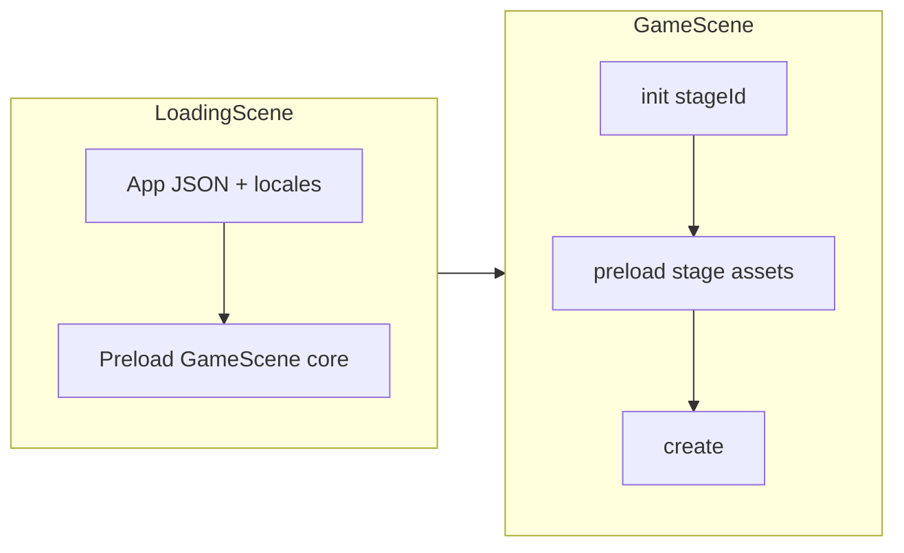

# Kế hoạch lazy load asset cho GameScene

## Hiện trạng (đã đọc code)

- [`LoadingScene.ts`](TeyvatCard/src/scenes/LoadingScene.ts): Sau khi có theme + JSON app (`libraryCards.json`, `dungeonList.json`, …), gọi `assetManager.preloadSceneAssets(this.targetScene, …)` rồi `scene.start(targetScene, dataTargetScene)`.
- [`AssetManager.ts`](TeyvatCard/src/core/AssetManager.ts): `GameScene` đang preload **danh sách atlas cố định** (`ATLAS_PATHS_BY_SCENE.GameScene`: item, character, coin, weapon-catalyst/sword, enemy-hilichurl, food, trap, treasure, bomb, badge…) + **ảnh/audio cố định** (nền mọi map trong `dungeonList`, toàn bộ `WEAPON_CATALYST_*`, `ANIMATIONS_ASSETS`, `CHARACTER_SPRITE_ASSETS`, …).
- [`GameScene.ts`](TeyvatCard/src/scenes/GameScene.ts): Không có `preload()`; chỉ dùng texture đã load sẵn trong `init`/`create`.
- [`dungeonList.json`](TeyvatCard/public/data/dungeonList.json): Mỗi map có `availableCards` (theo nhóm `enemies`, `weapons`, …) — **đúng tập thẻ có thể xuất hiện** trên map đó.
- [`libraryCards.json`](TeyvatCard/public/data/libraryCards.json) (và bản server): Metadata `type`, `category`, `clan`, `className`, `id` — dùng để map thẻ → **atlas key** giống logic đã có trong [`buildCardAtlasKey` / `getLibraryCardAtlasKey`](TeyvatCard/src/modules/card/view.ts) + [`libraryCardAtlas.ts`](TeyvatCard/src/components/LibraryScene/libraryCardAtlas.ts): `weapon` → `weapon-{category}`, `enemy` → `enemy-{clan}`, các loại khác thường là `food`, `trap`, … (trùng tên file atlas dưới `public/data/atlas/*.json`).

## Mục tiêu

1. **Giảm bytes / số request** trước khi vào trận bằng cách không tải atlas/ảnh không dùng trên map (ví dụ map chỉ sword thì không cần atlas `weapon-catalyst` + ảnh catalyst rời).
2. **Giữ ưu tiên atlas** (một file ảnh + JSON) thay vì nhiều ảnh lẻ khi số thẻ cùng nhóm đủ lớn — phù hợp cách render hiện tại (`createCardImage` ưu tiên atlas + frame).
3. **Có đường thoát hiểu nghĩa**: nếu sau này có thẻ chỉ có file lẻ (không nằm atlas), có thể bổ sung metadata hoặc manifest để `loadImage` có chọn lọc.

## Đề xuất kiến trúc

### 1) Tách “core” vs “theo stage”

- **Core (luôn load trong `preloadSceneAssets('GameScene')` hoặc giai đoạn 1)** — tối thiểu để UI/character/deck không vỡ:
  - Atlas: `item`, `character`, `coin` (và `empty` / ảnh empty nếu không nằm atlas).
  - Audio: `SOUND_EFFECT_ASSETS` (hoặc tách nhỏ sau nếu cần).
  - **Nền map**: chỉ texture của **map đang chơi** (đã gần đúng ý tưởng “theo stage”; hiện tại [`queueGameSceneMapBackgroundTexture`](TeyvatCard/src/core/AssetManager.ts) load mọi `map_background` trong list — nên thu hẹp theo `stageId` truyền từ LoadingScene).
- **Theo stage (lazy trong `GameScene.preload()` hoặc batch 2 trước `create`)**:
  - Từ `dungeonList` tìm bản ghi `stageId === …`.
  - Lấy **tất cả** `className` trong `availableCards` (gộp các nhóm).
  - Với mỗi `className`, tra trong `libraryCards` (theo `className`) → suy ra `atlasKey` = `buildCardAtlasKey(entry)` (cùng quy tắc với [`view.ts`](TeyvatCard/src/modules/card/view.ts)).
  - Map `atlasKey` → đường dẫn JSON quy ước: `atlas/${atlasKey}.json` (đồng bộ với cách đặt tên file hiện tại).
  - **Hợp badge**: nếu map có `weapon` loại `sword`, thêm `atlas/weapon-sword-badge.json` khi UI bán/badge cần (điều kiện cụ thể nên khớp chỗ dùng texture badge trong game — hiện GameScene đang load sẵn catalyst badge images; cần **lọc theo category thật sự có trên map + vũ khí nhân vật** để không thiếu texture khi đổi đồ).

### 2) Truyền `stageId` vào pipeline preload

- [`LoadingScene`](TeyvatCard/src/scenes/LoadingScene.ts) đã có `this.dataTargetScene` (ví dụ `{ stageId }` từ [`MapScenes`](TeyvatCard/src/scenes/MapScenes.ts)).
- **Thay đổi cần có**: `assetManager.preloadSceneAssets('GameScene', cb, context)` nhận thêm `{ stageId?: string }` để:
  - Lọc background chỉ một map.
  - (Tuỳ chọn) Nếu muốn giữ **một lần load hết** trong LoadingScene: truyền `stageId` vào và tính danh sách atlas theo stage ngay ở đó — không bắt buộc tách sang `GameScene.preload()` nếu bạn muốn tránh màn hình đen thêm một phase; khi đó “lazy” = **ít asset hơn**, không nhất thiết = **scene thứ hai**.

### 3) GameScene: thêm `preload()` (nếu chọn lazy sau LoadingScene)

- Phaser chạy `init → preload → create`; `stageId` set trong `init` từ `SceneData` sẵn có cho `preload`.
- Trong `preload()`: queue batch atlas JSON qua `DataManager.queueJsonFromData` + `load.start()` giống pattern trong [`AssetManager.preloadSceneAssets`](TeyvatCard/src/core/AssetManager.ts) (có thể **tách hàm dùng chung** `loadAtlasBatchFromPaths(scene, paths, onComplete)` để tránh duplicate logic `onAtlasJsonBatchComplete`).
- **Lưu ý**: `CardFactory` / `setCurrentStage` hiện chạy trong [`CardManager` constructor](TeyvatCard/src/core/CardManager.ts) khi `create()` — thứ tự vẫn ổn vì atlas chỉ cần sẵn trước khi tạo thẻ/lưới; nếu có code nào tạo sprite trong `preload`, phải đảm bảo texture đã load.

### 4) Ảnh rời (`AssetConstants`) — lọc thay vì xoá hết

- [`queueNonAtlasAssets` GameScene](TeyvatCard/src/core/AssetManager.ts) đang `loadImages([...WEAPON_CATALYST_BADGE_ASSETS])` và `WEAPON_CATALYST_ASSETS` toàn bộ: nên thay bằng **subset** theo category vũ khí xuất hiện trong `availableCards` + nhân vật đang chơi (tránh thiếu icon khi không nằm trong pool map nhưng vẫn trang bị).
- `ANIMATIONS_ASSETS` + `CHARACTER_SPRITE_ASSETS`: có thể giảm xuống **nhân vật đang chọn** + animation liên quan skill (tra từ `nameId` character / storage), thay vì load tất cả nhân vật.

### 5) Khi nào “ưu tiên atlas” vs “ảnh lẻ”

- **Mặc định**: Một `atlasKey` → một cặp `(json + webp)` — **ít HTTP hơn** so với N ảnh lẻ cho cùng nhóm thẻ; giữ đúng hướng bạn mô tả.
- **Ngưỡng chuyển / map pack (tuỳ chọn, sau)**:
  - Nếu một map cần **rất nhiều** atlas khác nhau (ví dụ > K atlas), chi phí tải K texture lớn có thể đánh đổi với **một atlas build theo map** (pipeline nội dung — ngoài phạm vi refactor code nhỏ).
  - Nếu chỉ thiếu vài frame trong atlas lớn: có thể bổ sung **ảnh lẻ** có `key === id` (đã hỗ trợ nhánh `textures.exists(nameId)` trong [`createCardImage`](TeyvatCard/src/modules/card/view.ts)).

### 6) Dữ liệu: `libraryCards.json` có đủ không?

- Để resolve `className` → `type` / `category` / `clan`, cần **tra được entry** trong `libraryCards` (đã dùng pattern tương tự [`findLibraryEntry`](TeyvatCard/src/modules/card/view.ts)).
- Nếu thiếu mapping (className lệch), cần **chuẩn hoá JSON** hoặc thêm bảng phụ `className → library id` — nên ghi rõ trong implementation để tránh fallback `empty` im lặng.

### 7) Kiểm thử tay

- Vào từng map có `availableCards` khác nhau; xác nhận không còn load atlas weapon-catalyst khi map chỉ sword.
- Đổi nhân vật / trang bị; xác nhận skill icon + badge không missing.
- Đường vào `GameScene` không có `stageId` (MenuScene): dùng fallback map mặc định như hiện tại ([`GameScene.init`](TeyvatCard/src/scenes/GameScene.ts)).

## Tệp chính sẽ đụng tới

- [`TeyvatCard/src/core/AssetManager.ts`](TeyvatCard/src/core/AssetManager.ts) — tách core/stage, API context `stageId`, lọc non-atlas.
- [`TeyvatCard/src/scenes/LoadingScene.ts`](TeyvatCard/src/scenes/LoadingScene.ts) — truyền `stageId` vào preload GameScene.
- [`TeyvatCard/src/scenes/GameScene.ts`](TeyvatCard/src/scenes/GameScene.ts) — (tuỳ chọn) `preload()` stage batch.
- Module mới gợi ý: `resolveGameSceneAtlasPathsForStage(stageId)` dùng `dataManager.getFlag('dungeonList'|'libraryCards')` + tái sử dụng logic từ [`view.ts`](TeyvatCard/src/modules/card/view.ts) / [`libraryCardAtlas.ts`](TeyvatCard/src/components/LibraryScene/libraryCardAtlas.ts) để **một nguồn sự thật** cho atlas key.

## Phạm vi không làm trong bước đầu (tránh phình scope)

- Tự động sinh atlas theo map từ build tool.
- Đổi format `libraryCards.json` lớn trên server nếu chưa đồng bộ client — chỉ ghi chú đồng bộ file `public/data/libraryCards.json`.
