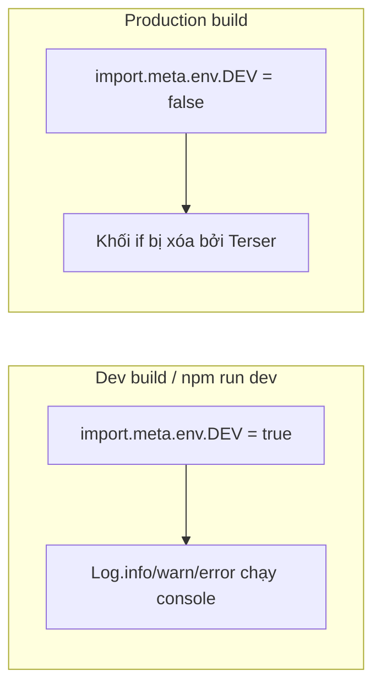

# Log class + dead code elimination (TeyvatCard)

## Hiện trạng

- **[TeyvatCard/vite.config.ts](TeyvatCard/vite.config.ts)** đã dùng `terserOptions.compress.drop_console: true` khi build production → mọi `console.`* đều bị xóa. Không dùng `vite-plugin-remove-console` (gây lỗi với Vite 6).
- **[TeyvatCard/.env.development](TeyvatCard/.env.development)** có `VITE_IS_DEV=true`.
- Trong **TeyvatCard/src** hiện không có file nào gọi `console.log`/`console.warn`/`console.error` (chỉ có trong `dev-dist`/workbox và `.git`). **[DataManager.ts](TeyvatCard/src/core/DataManager.ts)** đã dùng `import.meta.env.VITE_IS_DEV === 'true'` (dòng 15).

## Mục tiêu

1. Tạo class **Log** trong `TeyvatCard/src/utils` với `info`, `warn`, `error`, chỉ gọi `console.`* khi dev để minifier có thể **dead-code eliminate** cả khối khi build production.
2. Dùng điều kiện build-time (VITE_IS_DEV hoặc import.meta.env.DEV) để khi `VITE_IS_DEV=false` / production thì đoạn log bị bỏ hẳn (không chỉ nhờ `drop_console`).

## Cách DCE hoạt động

Vite thay thế `import.meta.env.VITE`_* và `import.meta.env.DEV` **tại build time**:

- **Dev:** `import.meta.env.DEV === true` hoặc `VITE_IS_DEV === 'true'` → khối log được giữ.
- **Production:** `import.meta.env.DEV === false` hoặc `VITE_IS_DEV === 'false'` → biểu thức thành hằng `false` → Terser xóa cả khối (dead code elimination), không còn code log trong bundle.




## Kế hoạch thực hiện

### 1. Tạo `TeyvatCard/src/utils/Log.ts`

- Export class **Log** với các static method: **info**, **warn**, **error**.
- Mỗi method nhận `...args: any[]`, bên trong chỉ gọi `console.log`/`console.warn`/`console.error` khi điều kiện build-time đúng.
- Điều kiện dùng **một trong hai** (nên chọn một cho thống nhất):
  - **Cách A:** `import.meta.env.DEV` — chuẩn Vite, không cần biến env. Production build tự là `false`.
  - **Cách B:** `import.meta.env.VITE_IS_DEV === 'true'` — khớp với `.env.development` và yêu cầu của bạn; cần đảm bảo production có `VITE_IS_DEV=false` (xem bước 2).

Ví dụ (Cách B – VITE_IS_DEV):

```ts
// Log.ts
export class Log {
  static info(...args: any[]) {
    if (import.meta.env.VITE_IS_DEV === 'true') {
      console.log(...args);
    }
  }
  static warn(...args: any[]) {
    if (import.meta.env.VITE_IS_DEV === 'true') {
      console.warn(...args);
    }
  }
  static error(...args: any[]) {
    if (import.meta.env.VITE_IS_DEV === 'true') {
      console.error(...args);
    }
  }
}
```

- Đảm bảo **chỉ có một nhánh** trong `if` và điều kiện là hằng tại build time để Terser DCE được (không gán `console` ra biến ngoài, không gọi hàm phức tạp trong nhánh dev).

### 2. Cấu hình env production (nếu dùng VITE_IS_DEV)

- Tạo hoặc cập nhật **TeyvatCard/.env.production** với `VITE_IS_DEV=false` để khi chạy `npm run build` (NODE_ENV=production), Vite inject `import.meta.env.VITE_IS_DEV = 'false'` → điều kiện trong Log thành `false` → DCE.
- Nếu dùng `import.meta.env.DEV` thì không cần file này (Vite tự set DEV theo mode).

### 3. Không sửa server / admin-web

- Thay đổi chỉ trong **TeyvatCard** (game Phaser). Server và admin-web giữ nguyên cách dùng `console` hiện tại.

### 4. Thay thế / quy ước console trong TeyvatCard

- Hiện trong **TeyvatCard/src** không có chỗ nào gọi `console.log`/`warn`/`error`. Kế hoạch:
  - Từ giờ **chỉ dùng** `Log.info` / `Log.warn` / `Log.error` trong TeyvatCard khi cần log.
  - Có thể thêm comment ngắn ở đầu `Log.ts` hoặc trong README TeyvatCard: "Dùng Log thay cho console để tự bỏ khi build production (DCE)."
- Nếu sau này có thêm file trong TeyvatCard mà dùng `console.`*, sẽ thay bằng `Log.`* tương ứng.

### 5. (Tùy chọn) Re-export từ utils

- Nếu đã có **TeyvatCard/src/utils/index.ts** (hoặc barrel), có thể export `Log` từ đó để import gọn: `import { Log } from '@/utils'` hoặc `from '@/utils/Log'`.

## Tóm tắt file


| Hành động    | File                                                                                                         |
| ------------ | ------------------------------------------------------------------------------------------------------------ |
| Tạo mới      | `TeyvatCard/src/utils/Log.ts` (class Log với info, warn, error; điều kiện VITE_IS_DEV hoặc DEV)              |
| Tạo/cập nhật | `TeyvatCard/.env.production` (nếu dùng VITE_IS_DEV: đặt `VITE_IS_DEV=false`)                                 |
| Không đổi    | server, admin-web, vite.config.ts (giữ drop_console hoặc không đều được; Log vẫn bị DCE khi điều kiện false) |


Sau khi làm xong, build production (`npm run build` trong TeyvatCard) sẽ không chứa code log từ Log class nhờ DCE; khi chạy dev với `VITE_IS_DEV=true` thì log vẫn hoạt động.