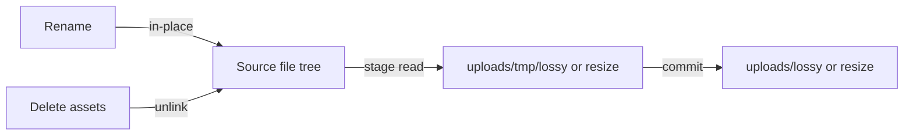

# Manager Assets: edit ảnh cho toàn bộ cây `images`

## Hiện trạng

- `[ManagerAssets.tsx](admin-web/src/pages/ManagerAssets.tsx)`: `openEditModal` chỉ mở `[UploadedImageEditModal](admin-web/src/components/assets/UploadedImageEditModal.tsx)` khi `[isUploadedFile](admin-web/src/pages/ManagerAssets.tsx)` (đường dẫn `/uploads/...` trừ tmp/resize/lossy). File dưới `/assets/images/...` mở modal đơn giản (đổi tên / xóa cards) — **không** có lossy/resize.
- `[ImageEditModal](admin-web/src/components/assets/UploadedImageEditModalBody.tsx)` gọi `[filesService.stageConvertToWebpLossy` / `stageResize*](admin-web/src/services/filesService.ts)` với **chỉ** `filename` (basename).
- Server `[stageConvertToWebpLossy` / `stageResizeUploaded` / `stageResizeUploadedToWebpLossy](server/src/services/filesService.ts)` luôn đọc nguồn từ `path.join(getUploadsDir(), basename)` — không dùng `[resolveAssetsImageFilePath](server/src/services/filesService.ts)` hay `[resolveUploadedFilePath](server/src/services/filesService.ts)` cho file trong thư mục con.
- `[commitStagedPreview](server/src/services/filesService.ts)` đã di chuyển file staged sang `getUploadsLossyDir()` / `getUploadsResizeDir()` → URL `/uploads/lossy/...` và `/uploads/resize/...` — **đúng** với nguyên tắc “đầu ra edit (không phải rename) luôn ở lossy và resize”.

## Hướng xử lý

### 1. Server: staging theo đường dẫn web đầy đủ

- Trong `[server/src/services/filesService.ts](server/src/services/filesService.ts)`, thêm helper nội bộ (ví dụ `resolveStageSourceFilePath`) nhận:
  - `filename?: string` (giữ tương thích cũ), hoặc
  - `sourceWebPath?: string`: nếu bắt đầu bằng `/assets/images/` → `resolveAssetsImageFilePath`; nếu bắt đầu bằng `/uploads/` → `resolveUploadedFilePath` (hỗ trợ cả file trong thư mục con uploads).
- **Từ chối** nguồn từ `/uploads/tmp/`, `/uploads/lossy/`, `/uploads/resize/` (và tương đương nếu có) để tránh pipeline lặp.
- Cập nhật `stageConvertToWebpLossy`, `stageResizeUploaded`, `stageResizeUploadedToWebpLossy` để dùng đường dẫn disk từ helper thay vì chỉ `getUploadsDir() + basename`.
- **targetFilename** khi nguồn là assets (hoặc uploads sâu): hiện logic chỉ dùng basename → dễ trùng tên giữa các thư mục. Nên tạo **stem duy nhất** từ phần relative (ví dụ thay `/` bằng `_` trong đường dẫn tương đối so với root tương ứng) rồi ghép hậu tố `-q…` / `-WxH…` như hiện tại, để giảm va chạm khi commit vào thư mục phẳng `lossy`/`resize`.

### 2. Controller / routes

- `[server/src/controllers/filesController.ts](server/src/controllers/filesController.ts)`: các handler `stageConvertToWebpLossyHandler`, `stageResizeUploadedHandler`, `stageResizeUploadedToWebpLossyHandler` đọc thêm `sourceWebPath` (optional) từ body, truyền xuống service.
- Giữ nguyên route `/files/uploaded/stage/...` (tránh đổi contract URL hàng loạt); chỉ mở rộng body.

### 3. Server: xóa file trong `assets/images`

- Hiện **chưa** có endpoint tương tự `deleteUploaded`; cần thêm (ví dụ `deleteAssetsImageFile(webPath)` trong `[server/src/services/filesService.ts](server/src/services/filesService.ts)`):
  - Dùng `resolveAssetsImageFilePath(webPath)`; chỉ xóa nếu là file thường, tồn tại, và nằm dưới `getImagesRootPath()` (đã đảm bảo bởi resolver).
  - Trả `{ success: true }` hoặc `{ error: string }` giống pattern delete uploaded.
- `[server/src/routes/files.ts](server/src/routes/files.ts)`: đăng ký `DELETE /files/assets` (hoặc `DELETE` với body `{ filePath }` — cùng style với các route admin khác).
- `[server/src/controllers/filesController.ts](server/src/controllers/filesController.ts)`: handler đọc `filePath`, gọi service.

### 4. Client `filesService`

- `[admin-web/src/services/filesService.ts](admin-web/src/services/filesService.ts)`:
  - Mở rộng `stageConvertToWebpLossy`, `stageResizeUploaded`, `stageResizeUploadedToWebpLossy` để gửi `{ filename?, sourceWebPath?, ... }` — với luồng mới luôn gửi `sourceWebPath: filePath` (hoặc chỉ gửi `sourceWebPath` và để server không cần `filename`).
  - Thêm `deleteAssetsImage(filePath: string)` gọi `DELETE /files/assets`.

### 5. `ImageEditModal` (body)

- `[UploadedImageEditModalBody.tsx](admin-web/src/components/assets/UploadedImageEditModalBody.tsx)`:
  - Mọi lời gọi stage dùng `**sourceWebPath: filePath`** (và bỏ phụ thuộc basename-only cho uploads có thư mục con).
  - **Rename**: nếu `filePath.startsWith('/assets/images/')` → `filesService.renameAssetsFile(filePath, newName)`; ngược lại giữ `renameUploaded(...)` như hiện tại.
  - **Xóa**: giữ `deleteUploaded` cho nguồn `/uploads/...`; với nguồn `/assets/images/...` gọi `deleteAssetsImage(filePath)`, xác nhận xóa như hiện tại (cùng UI confirm).

### 6. `ManagerAssets.tsx`

- `[openEditModal](admin-web/src/pages/ManagerAssets.tsx)`: nếu file là ảnh (cùng tiêu chí `isImagePath`) và (`isUploadedFile` **hoặc** `isAssetsImageFile`) → mở **cùng** modal chi tiết ảnh (`UploadedImageEditModal` / state hiện tại `uploadedDetailOpen`), thay vì chỉ uploaded.
- Có thể đổi tên state prop cho rõ (`imageEditOpen`) — tùy chọn, không bắt buộc.
- Modal đơn giản (`editModalOpen`) chỉ còn cho trường hợp **không** mở được image editor (ví dụ file không phải ảnh trong cây `manager-assets` vì `getImageTree` dùng `imageOnly` mặc định false — vẫn có thể có `.json`, v.v.): chỉ rename/delete theo quy tắc cũ.
- Cập nhật tiêu đề trong `[UploadedImageEditModal.tsx](admin-web/src/components/assets/UploadedImageEditModal.tsx)` (bỏ cứng “Uploaded” khi nguồn là assets) — prop `title` tùy loại hoặc tiêu đề trung tính (“Chi tiết ảnh”).

### 7. Kiểm tra nhanh

- Chọn ảnh trong `/assets/images/...` (vd. `animations`, `Spritesheet`) → Edit → tạo preview lossy/resize → commit → file xuất hiện dưới `/uploads/lossy` hoặc `/uploads/resize`, cây uploads refresh.
- Đổi tên file assets → đường dẫn `/assets/images/...` đổi, không ghi vào lossy/resize.
- Xóa file assets từ modal → file biến mất khỏi disk và cây sau `onSuccess`/refresh.

## Phạm vi không làm (trừ khi bạn muốn thêm)

- Đổi cách lưu commit (ví dụ ghi derivative ngay dưới thư mục nguồn) — trái với mô tả hiện tại của bạn.

