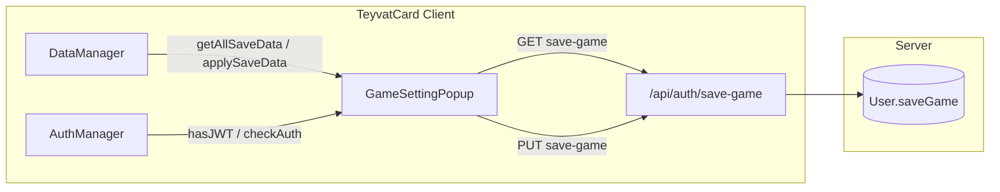

# Kế hoạch: Save/Load game lên server theo user đăng nhập

## Tổng quan luồng

---

## 1. DataManager: đọc/ghi dạng JSON “chưa encrypt” (cho cloud)

**File:** [TeyvatCard/src/core/DataManager.ts](TeyvatCard/src/core/DataManager.ts)

- **Export danh sách key cần lưu:** export `getKnownSaveKeys(): string[]` (hoặc export hằng `KNOWN_KEYS` dạng readonly) để dùng khi collect/apply. Hiện tại `KNOWN_KEYS` đang dùng cho `clear()`; có thể export getter trả về `Array.from(KNOWN_KEYS)` (bỏ `jwt`, `refreshToken` nếu không muốn đẩy lên server — thường chỉ lưu game state).
- **Hàm đọc hết data thành 1 JSON (dạng “plain”, chưa encrypt):**
  - `getAllSaveData(): Record<string, unknown>`
  - Duyệt từng key trong `KNOWN_KEYS` (hoặc list đã loại jwt/refreshToken), gọi `this.get(key)`; key nào có giá trị thì đưa vào object. Kết quả là JSON có thể gửi lên server (không cần decrypt trên server).
- **Hàm áp dụng JSON từ server xuống local:**
  - `applySaveData(data: Record<string, unknown>): void`
  - Duyệt từng key trong data; chỉ ghi vào storage nếu key nằm trong `KNOWN_KEYS` (tránh ghi key lạ). Gọi `this.set(key, value)` cho từng cặp. Có thể bỏ qua hoặc xóa key không nằm trong KNOWN_KEYS.

Lưu ý: Ở production, key trên localStorage là PREFIX + HMAC; `get`/`set` đã xử lý encrypt/decrypt và `toStorageKey`. `getAllSaveData` chỉ cần dùng `this.get()` để lấy giá trị đã decrypt và build object; `applySaveData` dùng `this.set()` để ghi (sẽ encrypt lại khi IS_DEV = false). Không cần thêm xử lý “proct” riêng nếu toàn bộ key cần cloud đều nằm trong KNOWN_KEYS; nếu sau này có key “proct” (protect) đặc biệt thì có thể lọc bỏ trong `getAllSaveData` và không ghi trong `applySaveData`.

---

## 2. Server: trường `saveGame` và API GET/PUT

**Model User:** [server/src/models/User.ts](server/src/models/User.ts)

- Thêm field:
  - `saveGame: { type: Schema.Types.Mixed, default: null }` (JSON tùy ý do client gửi).

**Auth routes + controller:**

- Thêm 2 endpoint (chỉ cần `authenticate`, không cần `authorize`):
  - **GET** `/api/auth/save-game`  
    - Đọc `req.user.userId`, tìm user, trả về `{ saveGame: user.saveGame }` (có thể null).
  - **PUT** (hoặc PATCH) `/api/auth/save-game`  
    - Body: `{ saveGame: object }`. Validate body (ví dụ Zod: object tùy ý hoặc record string -> unknown). Cập nhật `user.saveGame` và save.

Đăng ký route trong [server/src/routes/auth.ts](server/src/routes/auth.ts) với middleware `authenticate` (sau các route không cần đăng nhập). Tạo handler trong [server/src/controllers/authController.ts](server/src/controllers/authController.ts) (hoặc tách sang controller riêng nếu muốn).

---

## 3. Client: ApiConfig + gọi API save/load

**File:** [TeyvatCard/src/utils/ApiConfig.ts](TeyvatCard/src/utils/ApiConfig.ts)

- Thêm:
  - `saveGame:` ${this.baseUrl}/api/auth/save-game`` (dùng cho cả GET và PUT).

**Service/helper (có thể trong utils hoặc gần AuthManager):**

- `getSaveGameFromServer(): Promise<Record<string, unknown> | null>`  
  - `fetch(ApiConfig.saveGame, { credentials: 'include' })`, parse JSON, trả về `data.saveGame ?? null`.
- `sendSaveGameToServer(payload: Record<string, unknown>): Promise<boolean>`  
  - `fetch(ApiConfig.saveGame, { method: 'PUT', credentials: 'include', headers: { 'Content-Type': 'application/json' }, body: JSON.stringify({ saveGame: payload }) })`, trả về true nếu res.ok.

Gọi từ GameSettingPopup khi bấm Load/Save (sau khi đã kiểm tra đăng nhập).

---

## 4. GameSettingPopup: Load / Save chỉ khi đăng nhập, chưa đăng nhập thì chuyển trang đăng nhập

**File:** [TeyvatCard/src/components/SettingsScene/GameSettingPopup.ts](TeyvatCard/src/components/SettingsScene/GameSettingPopup.ts)

- **Trạng thái đăng nhập:**  
  - Dùng `AuthManager.hasJWT()` (hoặc sau khi gọi `AuthManager.checkAuth()`) để biết đã đăng nhập chưa. Có thể gọi `checkAuth()` khi mở popup (hoặc khi scene load) và lưu vào biến/state để nút Load/Save enable/disable.
- **Nút Load và Save:**
  - Chỉ **khả dụng (enabled)** khi đã đăng nhập.
  - Khi **chưa đăng nhập** mà bấm Load hoặc Save: **chuyển đến trang đăng nhập**. Cách chuyển cần thống nhất với cách app đang dùng:
    - Nếu game có scene đăng nhập (ví dụ `LoginScene`): gọi `scene.scene.start('LoginScene')` (hoặc key tương ứng) và có thể đóng popup trước.
    - Nếu đăng nhập là một route/màn hình riêng (VD `/login`): `window.location.href = '/login'` hoặc `window.location.hash = '#login'`.
  - Khi **đã đăng nhập**:
    - **Load:** gọi API GET save-game → nhận `saveGame` → gọi `dataManager.applySaveData(saveGame || {})`, có thể hiển thị thông báo thành công/lỗi.
    - **Save:** gọi `dataManager.getAllSaveData()` → gửi lên server qua PUT save-game, xử lý lỗi (401, 500) và thông báo.

Cần xác định trong codebase TeyvatCard **scene key hoặc URL dùng cho “trang đăng nhập”** để gắn vào hành vi “chuyển đến trang đăng nhập”. Nếu chưa có, cần thêm scene hoặc route tương ứng.  

---

## 5. Tóm tắt file cần chỉnh/thêm

| Vị trí                                                        | Thay đổi                                                                                                                                                                        |
| ------------------------------------------------------------- | ------------------------------------------------------------------------------------------------------------------------------------------------------------------------------- |
| `TeyvatCard/src/core/DataManager.ts`                          | Export getter cho keys cần lưu; thêm `getAllSaveData()`, `applySaveData()`. Có thể loại `jwt`/`refreshToken` khỏi danh sách key đẩy lên server.                                 |
| `server/src/models/User.ts`                                   | Thêm field `saveGame` (Mixed).                                                                                                                                                  |
| `server/src/controllers/authController.ts`                    | Thêm handler GET/PUT save-game (đọc/ghi `user.saveGame` theo `req.user.userId`).                                                                                                |
| `server/src/routes/auth.ts`                                   | Đăng ký GET/PUT `/save-game` với `authenticate`.                                                                                                                                |
| `server/src/validators/auth.ts` (hoặc mới)                    | Validate body PUT `{ saveGame: object }` (Zod).                                                                                                                                 |
| `TeyvatCard/src/utils/ApiConfig.ts`                           | Thêm URL `saveGame`.                                                                                                                                                            |
| `TeyvatCard/src/components/SettingsScene/GameSettingPopup.ts` | Kiểm tra đăng nhập; enable/disable Load & Save; khi chưa đăng nhập bấm nút → chuyển trang đăng nhập; khi đã đăng nhập: Load = GET + applySaveData, Save = getAllSaveData + PUT. |

Sau khi có scene/key hoặc URL đăng nhập cụ thể, chỉ cần gắn vào bước “chuyển đến trang đăng nhập” trong GameSettingPopup là đủ.