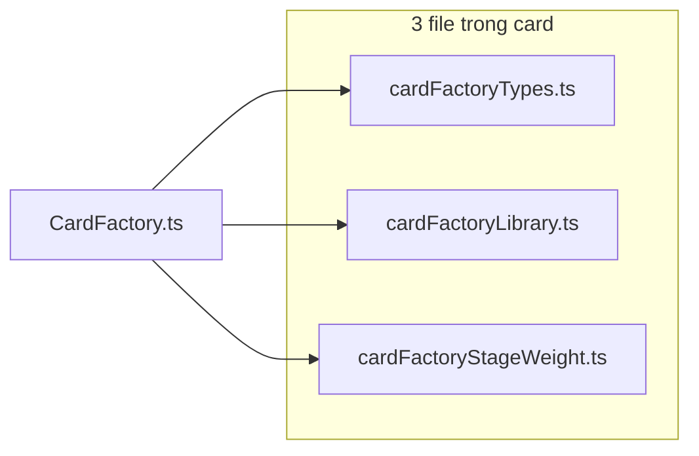

# Tách phụ trợ CardFactory vào `modules/card` (chỉ ~3 file mới)

## Vấn đề hiện tại

`[CardFactory.ts](TeyvatCard/src/modules/CardFactory.ts)` (~500 dòng) gom types, đăng ký library, pool stage, trọng số, random weighted, tra key class.

Mục tiêu: **giữ `CardFactory` làm lớp có state**, chuyển phần thuần logic sang `[card/](TeyvatCard/src/modules/card/)` nhưng **không tạo quá nhiều file** — chỉ **3 file TypeScript mới** (cộng với `[view.ts](TeyvatCard/src/modules/card/view.ts)` đã có, không đụng trừ khi cần import type chung sau này).

## Kiến trúc sau tách (gọn)

## Ba file mới (đặt tên rõ domain, tránh `index.ts` barrel)

| File                                 | Nội dung (gom theo nhóm, có thể chia bằng comment section trong file)                                                                                                                                                                                                                                               |
| ------------------------------------ | ------------------------------------------------------------------------------------------------------------------------------------------------------------------------------------------------------------------------------------------------------------------------------------------------------------------- |
| `**card/cardFactoryTypes.ts**`       | Toàn bộ type/interface hiện dùng trong factory: `StageCardPool`, `DungeonItem`, entry `libraryCards` (ví dụ `LibraryCardsFactoryEntry` nếu cần tránh nhầm với `view.ts`), `LibraryCards`, `CardClassRegistry`, `CardClassesMap`, v.v.                                                                               |
| `**card/cardFactoryLibrary.ts**`     | Build `allCardClasses` từ namespace `cardImports`; `register(key, cls)`; `resolveByClassName`; `getTypeClassesFromLibrary`; kết quả `weaponClasses` / `enemyClasses` / … / `coinClasses`; side-effect đăng ký `bomb`/`empty` như hiện tại. Export một hàm “setup” hoặc vài hàm export rõ tên thay vì tách file con. |
| `**card/cardFactoryStageWeight.ts**` | `loadStagePoolsFromDungeonList`; `computeCardWeights` + `computeDynamicCardWeights` (dùng chung lõi lặp giữa hai nhánh); `pickWeightedCardKey`; `findRegistryKeyForClass` (bỏ qua `'add'`). Inject `getCardConfig` để tránh vòng phụ thuộc.                                                                         |

**Không thêm** `index.ts` barrel để giảm “rác” import layer — `CardFactory` import trực tiếp `./card/cardFactoryTypes.js`, `./card/cardFactoryLibrary.js`, `./card/cardFactoryStageWeight.js`.

Nếu sau này một file phình quá ~400 dòng, có thể tách thêm lần hai; lần này ưu tiên **3 file**.

## Thay đổi trong `CardFactory.ts`

- Import types từ `cardFactoryTypes.ts`.
- Constructor: gọi helper từ `cardFactoryLibrary.ts` (và giữ map `characterClasses` trong factory hoặc constant cùng file — không bắt buộc tách thêm file thứ 4).
- `_ensureStagePoolsLoaded` / weights / random / lookup: delegate `cardFactoryStageWeight.ts`.
- Cache `_cachedCardWeights`, `stageCardPools`, `currentStage` vẫn thuộc instance `CardFactory`.

## Quy ước import

Giữ suffix `.js` trong import như codebase hiện tại.

## Kiểm tra sau refactor

- Build/typecheck package `TeyvatCard`.
- Hành vi random/weight giữ tương đương (thứ tự duyệt `Object.entries` nếu có).

## Phạm vi không làm

- Gộp type với `card/view.ts` (tránh scope phình).
- Đổi API public `CardFactory` / export default.

