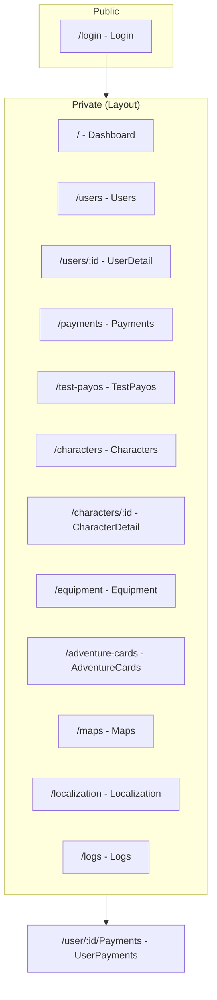
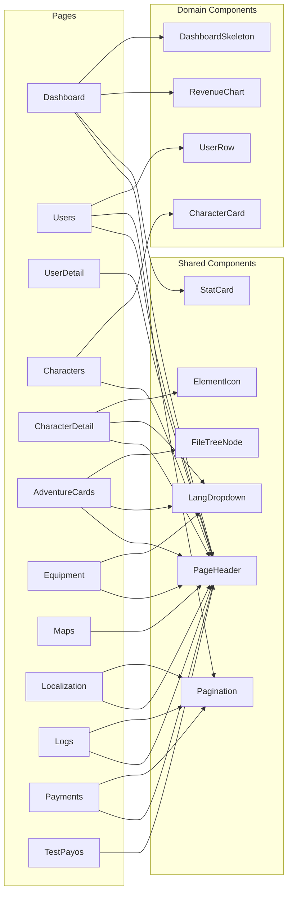
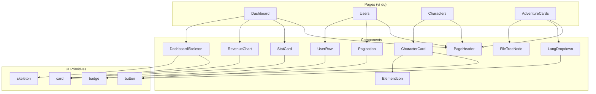
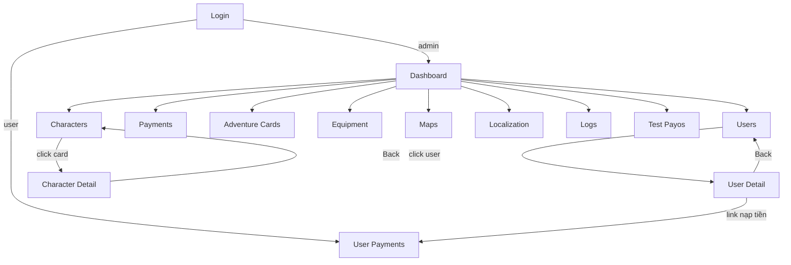

# Báo cáo: Các page đã refactor

Tài liệu mô tả các thay đổi sau khi tách UI các trang trong `admin-web/src/pages` thành các component nhỏ trong `admin-web/src/components`, kèm diagram quan hệ giữa các trang và component.

---

## 1. Tổng quan

- **Mục tiêu:** Giảm độ phức tạp từng file page, tăng khả năng tái sử dụng và bảo trì.
- **Cách làm:** Tách phần UI lặp lại (header, phân trang, dropdown ngôn ngữ, thẻ thống kê, v.v.) thành component trong `admin-web/src/components`, sau đó refactor từng page để dùng các component này.

---

## 2. Component mới

### 2.1 Component dùng chung (`src/components/`)

| Component | Mô tả | Dùng tại |
|-----------|--------|----------|
| `PageHeader` | Tiêu đề trang (title + description, gradient tùy chọn) | Mọi page có header thống nhất |
| `Pagination` | Phân trang (Previous/Next, hiển thị range) | Users, Logs, Payments, Localization |
| `LangDropdown` | Dropdown chọn ngôn ngữ (en / vi / ja) | AdventureCards, CharacterDetail, Equipment |
| `StatCard` | Thẻ thống kê (icon, title, value, gradient) | Dashboard |
| `ElementIcon` | Icon element (ảnh hoặc "none" với dấu X) | Characters, CharacterDetail |
| `FileTreeNode` | Node cây thư mục/tệp (expand/collapse, chọn file) | AdventureCards (chọn ảnh) |

### 2.2 Component theo từng khu vực

| Thư mục | Component | Mô tả | Dùng tại |
|---------|-----------|--------|----------|
| `dashboard/` | `RevenueChart` | Line chart (revenue hoặc users) | Dashboard |
| `dashboard/` | `DashboardSkeleton` | Skeleton loading | Dashboard |
| `users/` | `UserRow` | Một dòng user (avatar, email, role, xu, badge) | Users |
| `characters/` | `CharacterCard` | Thẻ nhân vật (ảnh, element, tên) | Characters |

---

## 3. Các page đã refactor

| Page | Đường dẫn route | Component đã dùng | Ghi chú |
|------|-----------------|-------------------|--------|
| **Dashboard** | `/` | PageHeader, StatCard, RevenueChart, DashboardSkeleton | Rút gọn logic, chart tái sử dụng |
| **Users** | `/users` | PageHeader, Pagination, UserRow | List user gọn, phân trang chung |
| **UserDetail** | `/users/:id` | PageHeader | Chỉ thay header |
| **Characters** | `/characters` | PageHeader, CharacterCard | Grid thẻ nhân vật tách component |
| **CharacterDetail** | `/characters/:id` | PageHeader, LangDropdown, ElementIcon | Header + ngôn ngữ + icon element |
| **AdventureCards** | `/adventure-cards` | PageHeader, LangDropdown, FileTreeNode | Bỏ TreeNode nội bộ, dùng FileTreeNode |
| **Equipment** | `/equipment` | PageHeader, LangDropdown | Header + dropdown ngôn ngữ |
| **Maps** | `/maps` | PageHeader | Chỉ thay header |
| **Localization** | `/localization` | PageHeader, Pagination | Header + phân trang chung |
| **Logs** | `/logs` | PageHeader, Pagination | Header + phân trang, bỏ Button không dùng |
| **Payments** | `/payments` | PageHeader, Pagination | Header + phân trang |
| **TestPayos** | `/test-payos` | PageHeader | Chỉ thay header |

**Không refactor trong đợt này:** Login (form + particles), UserPayments (flow riêng).

---

## 4. Sơ đồ quan hệ

### 4.1 Cấu trúc routing và trang (Layout → Pages)



### 4.2 Quan hệ Page → Component (trang dùng component nào)



### 4.3 Cây phụ thuộc component (component dùng component con)



### 4.4 Luồng điều hướng giữa các trang (navigation)



---

## 5. Cấu trúc thư mục sau refactor

```
admin-web/src/
├── components/
│   ├── Layout.tsx
│   ├── PageHeader.tsx
│   ├── Pagination.tsx
│   ├── LangDropdown.tsx
│   ├── StatCard.tsx
│   ├── ElementIcon.tsx
│   ├── FileTreeNode.tsx
│   ├── dashboard/
│   │   ├── RevenueChart.tsx
│   │   └── DashboardSkeleton.tsx
│   ├── users/
│   │   └── UserRow.tsx
│   ├── characters/
│   │   └── CharacterCard.tsx
│   └── ui/
│       ├── card.tsx
│       ├── skeleton.tsx
│       ├── badge.tsx
│       └── button.tsx
└── pages/
    ├── Dashboard.tsx
    ├── Users.tsx
    ├── UserDetail.tsx
    ├── Characters.tsx
    ├── CharacterDetail.tsx
    ├── AdventureCards.tsx
    ├── Equipment.tsx
    ├── Maps.tsx
    ├── Localization.tsx
    ├── Logs.tsx
    ├── Payments.tsx
    ├── TestPayos.tsx
    ├── Login.tsx
    └── UserPayments.tsx
```

---

## 6. Ghi chú

- Các diagram dùng **Mermaid**. Có thể xem trực tiếp trên GitHub, trong VS Code (extension Mermaid), hoặc tại [mermaid.live](https://mermaid.live).
- File báo cáo: `admin-web/doc/Các page đã refactor.md`.
